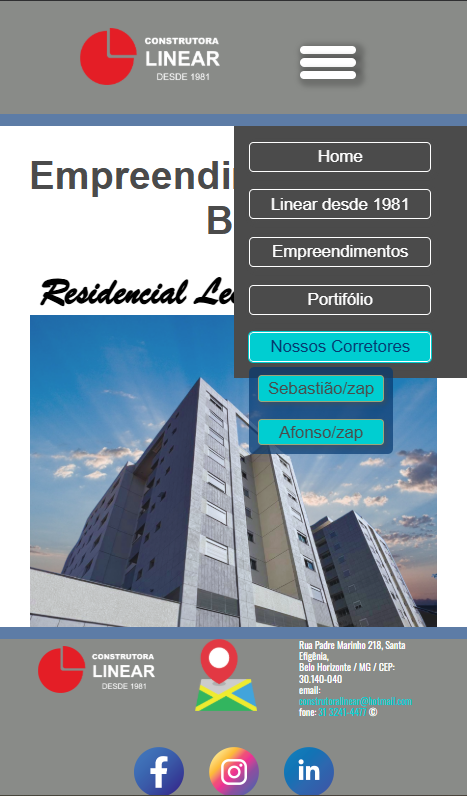

# 🏗️ Construtora Linear – Website

Professional website developed to represent a construction company, focusing on clarity, visual organization, and responsive design.  
This project was built as a **portfolio project** to demonstrate front-end development skills and best practices.

---

## 🎯 Objectives

- Create a professional online presence for a construction company  
- Showcase real estate developments in a clear and organized way  
- Ensure full responsiveness across devices  
- Maintain clean structure and organized assets for scalability  

---

## 🧩 Problem It Solves

Many small and medium construction companies lack a professional digital presence, making it difficult to:

- Present their real estate developments clearly  
- Build credibility with potential clients  
- Offer a good experience on mobile devices  

This project addresses those issues with a clean, responsive, and well-structured website.

---

## 🛠️ Technical Scope

- Front-end development  
- Responsive layout (mobile-first approach)  
- Structured organization of assets (images, styles, scripts)  
- Focus on usability and visual clarity  

---

## ⚙️ Tech Stack

- **HTML5**
- **CSS3**
- **JavaScript (Vanilla)**
- **Deployment:** Vercel

---

## 🚀 Live Demo

🔗 https://construtora-linear.vercel.app

---

## 📸 Screenshots

### Desktop


### Mobile


---

## 📁 Project Structure

```text
/
├── images/
├── styles/
├── scripts/
├── screenshots/
│   ├── Home-Desktop.png
│   ├── Empreendimentos-Desktop.png
│   ├── Home-mobile.png
│   └── .gitkeep
├── index.html
└── README.md

---

## 👤 Author

Patrick Armani  
Full Stack Developer  
Brazil 🇧🇷  
GitHub: https://github.com/patrickarmani
---

## 📄 License

This project is for portfolio and educational purposes.

